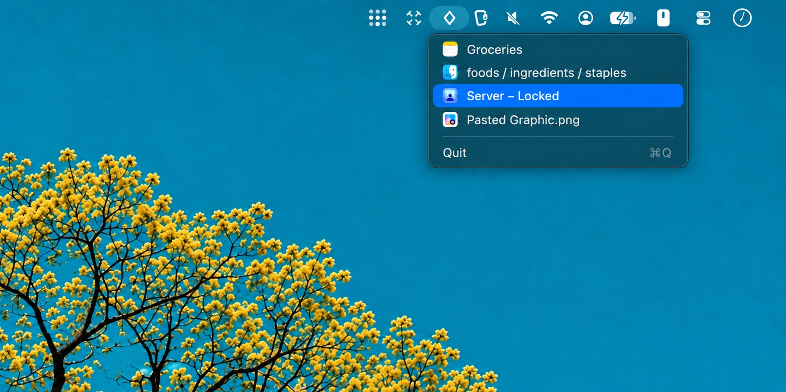

# Minimized Windows

A lightweight macOS menubar app that lists all your minimized windows and lets you restore them with a single click.

Useful if you keep your Dock hidden or [**have your Dock disabled**](https://github.com/numeono/macOS#disable-the-dock).

<p align="center">
  
</p>


## Screenshot



## Features

- **Menubar icon** — lives quietly in your menubar, zero CPU when idle
- **All minimized windows** — shows every minimized window across all apps
- **App icons** — each entry shows the app's icon for quick recognition
- **Sorted by time** — most recently minimized windows appear at the top
- **One-click restore** — click any entry to unminimize and focus that window
- **Launch at login** — registers itself as a login item automatically
- **Light & dark mode** — menubar icon adapts automatically

## Requirements

- macOS 12.0 (Monterey) or later
- Accessibility permission (required to detect and restore minimized windows)

## Installation

### Build from source

```bash
git clone https://github.com/numeono/minimized-windows.git
cd minimized-windows
bash build.sh
mv "build/Minimized Windows.app" /Applications/
open "/Applications/Minimized Windows.app"
```

Then grant Accessibility permission when prompted, or go to:  
**System Settings → Privacy & Security → Accessibility → add "Minimized Windows"**

### Requirements for building

- Xcode Command Line Tools (`xcode-select --install`)
- No other dependencies

## Why Accessibility permission?

macOS requires Accessibility access for any app that reads window state from other applications. This app uses it solely to detect minimized windows and restore them — it reads nothing else.

## How it works

The app uses the macOS Accessibility API (`AXMinimizedWindows` attribute) to query each running application for its minimized windows. It polls lightly in the background (every 2 seconds) to track the order in which windows were minimized. No network access, no data collection.

## License

MIT. See [LICENSE](LICENSE).
